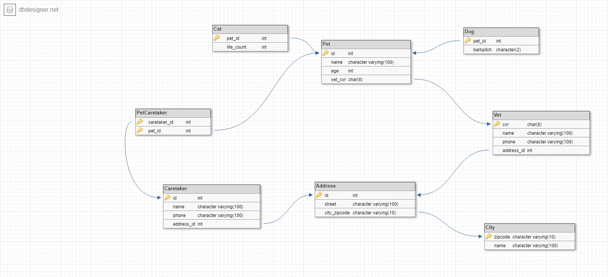

# Relational-DB

see assignment description [here](01-relational-db.pdf)

## ER-Diagram

## Joint-table strategy

## Table-per-class strategy

## Single-table strategy

## Implementation

## Install
